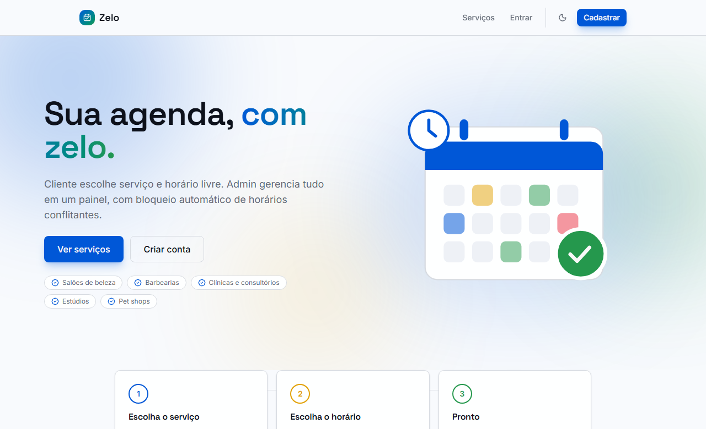
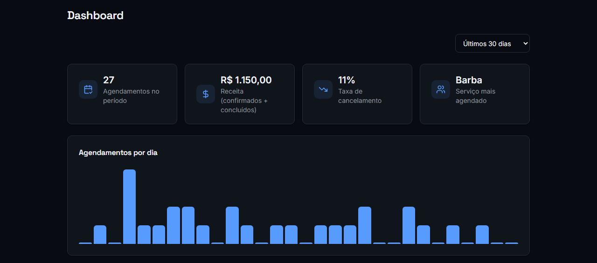

# Zelo


Sistema de agendamento online full stack para negócios de serviço (salões, clínicas, barbearias, estúdios). Cliente escolhe serviço e horário livre, admin gerencia tudo em um painel, com regra de conflito de horário, sincronia com Google Calendar e assistente de agendamento via IA.

Projeto construído em fases, cada uma terminando com algo funcionando e implantado (não só código local).



## Funcionalidades

- **Agendamento sem conflito**: reserva de horário protegida por transação com lock no banco, evita dois clientes marcando o mesmo horário
- **Horário de atendimento configurável**: horário por dia da semana + bloqueios manuais de data/hora (feriado, viagem, manutenção)
- **Assistente de agendamento via IA**: chat com Google Gemini que consulta serviços, verifica horários livres e cria o agendamento de verdade via function calling, não é só um chat decorativo
- **Google Calendar**: agendamentos confirmados viram evento real no Google Calendar do admin, e compromissos pessoais já existentes bloqueiam horários automaticamente
- **Dashboard de analytics**: volume de agendamentos por dia, distribuição por status, receita e serviços mais procurados
- **Painel admin completo**: CRUD de serviços, gestão de agendamentos com calendário visual (FullCalendar), confirmar/cancelar/concluir



## Stack

- **Frontend:** Next.js (App Router) + TypeScript + Tailwind CSS + SWR ([`/frontend`](./frontend))
- **Backend:** Laravel + Sanctum, API REST com autenticação via token ([`/backend`](./backend))
- **Banco:** SQLite em desenvolvimento, PostgreSQL (Neon) em produção
- **IA:** Google Gemini (function calling)
- **Integrações:** Google Calendar API (OAuth2)
- **Qualidade:** PHPStan (Larastan, nível 8) + Laravel Pint (PSR-12), 59 testes PHPUnit + 17 testes Jest/RTL, CI no GitHub Actions a cada push

## Deploy

- Frontend: [Vercel](https://agendamento-app-alpha.vercel.app)
- Backend: [Render](https://agendamento-app-2muq.onrender.com) (banco Postgres no Neon)
- Documentação da API: [/docs/api](https://agendamento-app-2muq.onrender.com/docs/api)

**Login de demonstração** (admin): `admin@agendamento.app` / `admin12345`

## Como rodar tudo local com Docker

```bash
docker-compose up
```

Sobe backend (`:8000`), frontend (`:3000`) e PostgreSQL, com hot-reload nos dois lados (código local é montado dentro dos containers). Não precisa de PHP/Node/Postgres instalados na máquina, só Docker.

## Fases do projeto

- [x] **Fase 0**: Esqueleto implantado, health-check + auth básico (Sanctum), backend e frontend no ar
- [x] **Fase 1**: MVP funcional, CRUD de serviços, agendamento com regra de conflito, dashboard admin
- [x] **Fase 2**: Docker Compose pra dev local + testes automatizados + CI (GitHub Actions)
- [x] **Fase 3**: Documentação de API (OpenAPI/Swagger)
- [x] **Fase 4**: Diferenciais. Calendário visual, horário de atendimento configurável, assistente de agendamento via IA, Google Calendar
- [x] **Fase 5**: Polimento final. Identidade de produto (nome/copy reais), ilustrações e dashboard de analytics
- [x] **Fase 6**: Referência visual e mobile. Redesign de UI/UX inspirado em SaaS reais, badges e ícones de estado, otimização do modo mobile

Cada subpasta tem seu próprio README com instruções de setup local (sem Docker, se preferir).
